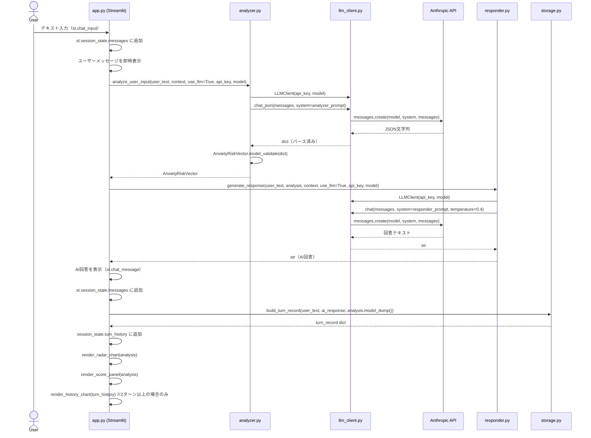
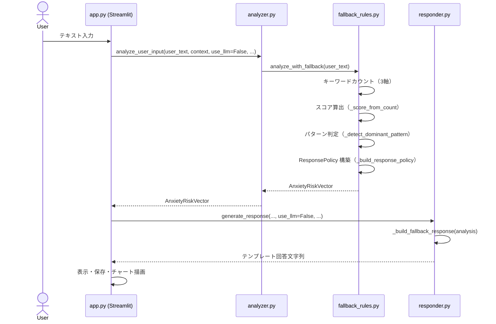
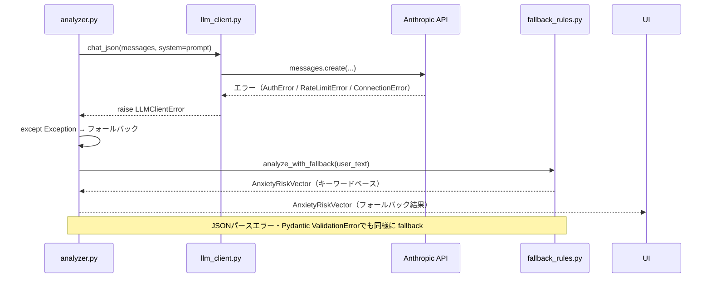
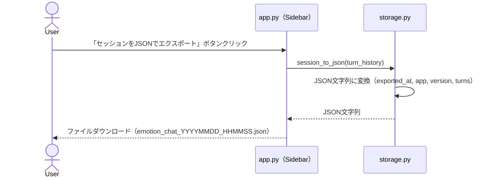
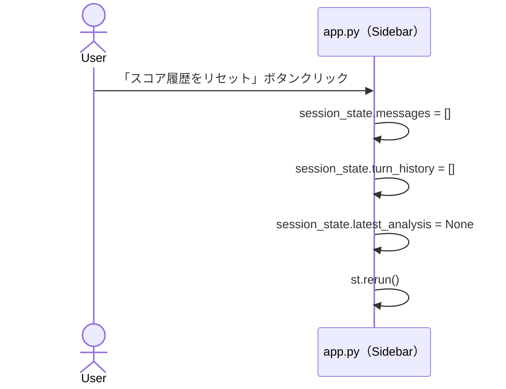
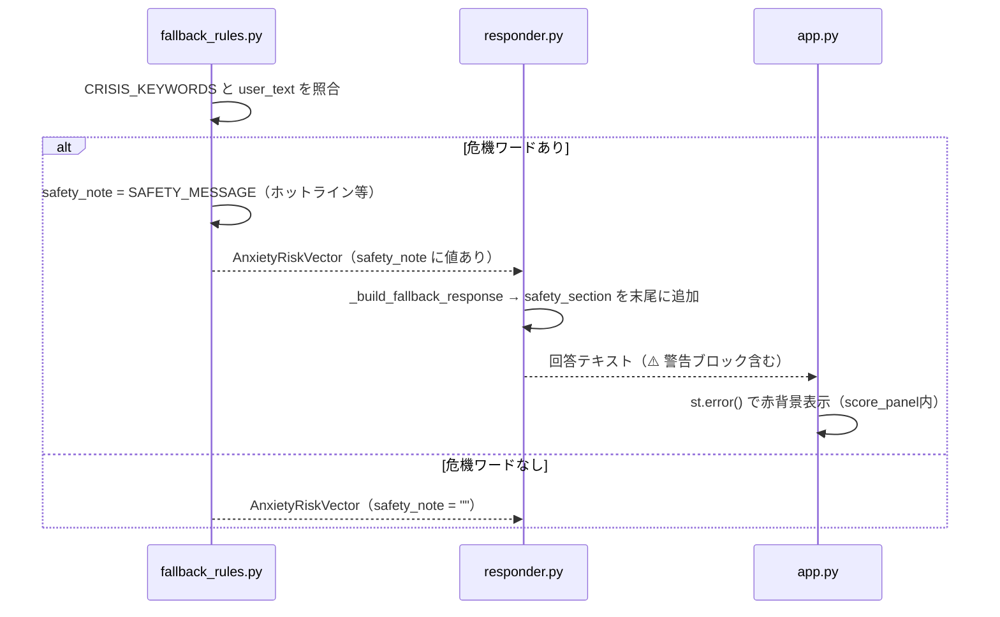

# Sequence Diagrams
<!-- spec-id: SPEC-SQ -->

## SPEC-SQ-01：メインチャットフロー（LLMモード）

---

## SPEC-SQ-02：メインチャットフロー（デモモード / フォールバック）

---

## SPEC-SQ-03：LLMエラー時のフォールバックフロー

---

## SPEC-SQ-04：セッションエクスポートフロー

---

## SPEC-SQ-05：セッションリセットフロー

---

## SPEC-SQ-06：危機ワード検出フロー

